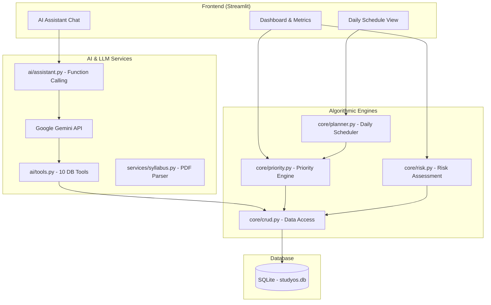

# StudyOS — Adaptive Academic Planning System & AI Assistant

StudyOS is an intelligent, autonomous academic scheduling platform and executive study assistant. Unlike static study timetables that fail when unexpected events occur, StudyOS models study tasks dynamically using mathematical urgency curves, mastery deficits, and risk bottleneck analytics. It continuously recalibrates your schedule in real time as deadlines shift, tasks are completed, or study sessions are skipped.

---

## 🚀 Key Features

* **Adaptive Prioritization Engine**:
  * **Urgency Curve**: Non-linear urgency scoring based on days remaining until deadlines, with smooth continuity to prevent priority inversion.
  * **Mastery Deficit Weighting**: Prioritizes topics and courses where current student mastery is lowest.
  * **Task Type & Importance Modifiers**: Calibrates weight across Revision, Assignments, Projects, and Exam Prep.
* **Risk & Bottleneck Detection**:
  * Calculates per-subject risk scores (0–100) based on impending exam dates, total remaining hours, and pending vs. skipped workloads.
  * Identifies critical academic bottlenecks before students fall behind.
* **Autonomous Gemini AI Executive Assistant**:
  * Connected to Google Gemini with **10 function-calling tools** allowing natural language control over the entire academic database.
  * Can schedule tasks, update mastery, generate daily study sessions, summarize weekly progress, and produce contextual revision quizzes.
* **Syllabus Ingestion Service**:
  * Extracts structured course outlines, units, and topics directly from syllabus PDFs using Gemini.
* **Real-Time Interactive Dashboard**:
  * Built with Streamlit, providing live priority heatmaps, subject progress metrics, daily scheduled session blocks, and an interactive AI chat interface.

---

## 🛠️ System Architecture



---

## 📁 Project Structure

```
StudyOS/
├── studyos/
│   ├── ai/
│   │   ├── assistant.py       # Gemini chat session with automatic tool calling
│   │   └── tools.py           # 10 DB & analytics tools exposed to Gemini
│   ├── core/
│   │   ├── crud.py            # SQLite data access layer
│   │   ├── database.py        # Schema initialization & table creation
│   │   ├── models.py          # Pydantic data validation models
│   │   ├── planner.py         # Daily study schedule generation algorithm
│   │   ├── priority.py        # Urgency & composite priority calculations
│   │   └── risk.py            # Subject risk & bottleneck evaluation engine
│   ├── services/
│   │   └── syllabus.py        # PDF syllabus text extraction & parsing via Gemini
│   ├── tests/
│   │   └── test_backend.py    # Comprehensive test suite (Priority, Risk, Planner, AI tools)
│   ├── app.py                 # Streamlit web application
│   ├── check_models.py        # Gemini API model verification script
│   └── requirements.txt       # Python dependencies
├── .gitignore
└── README.md
```

---

## 💻 Getting Started

### Prerequisites
* **Python 3.9+**
* A **Google Gemini API Key** (get one free at [Google AI Studio](https://aistudio.google.com/))

### 1. Clone & Setup Environment
```bash
git clone https://github.com/Suruchidoke/StudyOS.git
cd StudyOS/studyos

# Create and activate virtual environment
python -m venv venv
source venv/bin/activate        # On Linux/macOS
# or: venv\Scripts\activate     # On Windows
```

### 2. Install Dependencies
```bash
pip install -r requirements.txt
```

### 3. Configure Environment Variables
Create a `.env` file in the `studyos/` directory:
```env
GEMINI_API_KEY="your-gemini-api-key-here"
```

### 4. Run Automated Backend Tests
Verify that all mathematical scoring engines, scheduling algorithms, and database operations pass:
```bash
python tests/test_backend.py
```

### 5. Launch the Streamlit App
```bash
streamlit run app.py
```
*Open `http://localhost:8501` to access StudyOS.*

---

## 🤖 Available AI Tools

The integrated Gemini assistant can execute:
1. `get_academic_status`: Fetch full student overview, active courses, mastery %, and risks.
2. `get_study_plan(available_minutes)`: Generate an optimized daily study schedule.
3. `get_weekly_summary`: Summarize weekly completion rate, tasks due in 7 days, and high-risk bottlenecks.
4. `create_subject(name, mastery_percentage, importance, exam_date)`: Register a new course.
5. `update_subject_details(subject_id, ...)`: Adjust mastery, importance, or exam dates.
6. `delete_subject_by_id(subject_id)`: Remove a course and cascade delete its tasks.
7. `create_task(subject_id_or_name, title, task_type, deadline, duration, importance)`: Schedule study tasks.
8. `update_task_status(task_id, status, remaining_minutes)`: Update task completion or skip status.
9. `delete_task_by_id(task_id)`: Permanently remove a task.
10. `generate_quiz(subject_name, num_questions)`: Generate contextual practice questions tailored to current student mastery.

---

## 📄 License
This project is open source and available under the [MIT License](LICENSE).
